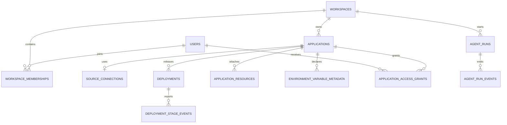

# Sprout Database Design

## Purpose

The first database supports one complete product path:

```text
user -> workspace -> agent run -> application -> deployment -> live status
```

PostgreSQL stores durable product state. Drizzle defines the schema and produces reviewed SQL migrations.

## Security boundary

The application database must never store:

- passwords or password hashes;
- OAuth access or refresh tokens;
- Git provider credentials or credential-bearing clone URLs;
- environment variable values, API keys, certificates, or private keys;
- raw agent prompts or model transcripts;
- source archives, build artifacts, or container images;
- raw build or runtime log streams.

`environment_variable_metadata` stores only a variable name, classification, and whether it is required. A dedicated secret manager will eventually store values using encryption, access auditing, and independent retention controls. The database will not contain a secret value or a pointer that can be used as a credential.

Authentication is delegated to an identity provider. `users` stores only the provider name and stable subject identifier; there is no password column. Repository connections store normalized provider, owner, repository, and branch fields instead of arbitrary URLs, preventing credentials from being embedded in a clone URL.

Agent runs persist lifecycle state and typed events only. Raw requests and model responses remain out of PostgreSQL until a separate redaction, retention, and encryption design exists.

## Initial relationships



## Table responsibilities

| Table | Responsibility |
| --- | --- |
| `users` | External identity mapping and display profile; no authentication secrets. |
| `workspaces` | Tenant boundary and workspace identity. |
| `workspace_memberships` | Workspace role for each user. |
| `applications` | Application identity and lifecycle. Runtime health comes from its latest deployment. |
| `source_connections` | Normalized repository identity; no tokens or arbitrary credential-bearing URLs. |
| `deployments` | One immutable release attempt and its safe summary status. |
| `deployment_stage_events` | Typed deployment progress without raw logs. |
| `application_resources` | Attached resource type, plan, and health state. |
| `environment_variable_metadata` | Variable names and classifications only; never values. |
| `application_access_grants` | Per-application editor or viewer access. Workspace owners remain authoritative. |
| `agent_runs` | Agent workflow lifecycle without prompt content. |
| `agent_run_events` | Ordered, typed progress events without arbitrary payloads. |

## Data and lifecycle rules

- Workspace and application slugs use lowercase letters, numbers, and single hyphens.
- User email uniqueness is case-insensitive.
- An application slug is unique within its workspace.
- Each application has at most one active source connection in the MVP.
- Deployment status is the source of truth for build/runtime presentation. Application lifecycle only records active, paused, or archived.
- Failure fields contain stable machine-readable codes, not raw provider responses that may contain credentials.
- Deleting a workspace cascades through its applications and operational records. Identity records are not deleted through workspace removal.
- Membership and access checks must scope every application query through its workspace.

## Migration workflow

```bash
cp .env.example .env
npm run db:generate
npm run db:check
npm run db:migrate
```

`DATABASE_URL` must come from an untracked local environment file or the deployment platform's secret store. Never commit a real database URL.

Drizzle Kit is development-only tooling. Run it from a trusted local environment or CI worker; do not expose Drizzle Studio or another database administration interface publicly.

## Deferred intentionally

- billing and subscriptions;
- custom domains and certificates;
- regions, clusters, nodes, and container scheduling;
- encrypted secret storage;
- raw log ingestion and retention;
- agent conversation persistence;
- artifact and source-code storage;
- provider-specific installation and token records.

These should be added only when the corresponding product workflow and security model are implemented.
